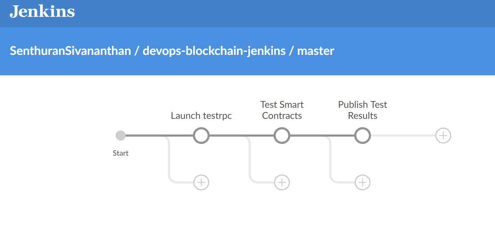
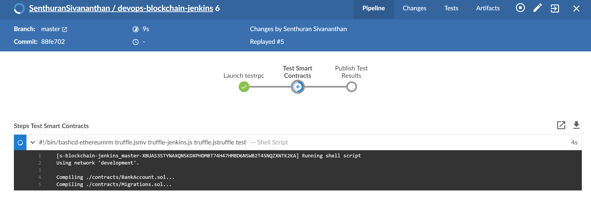
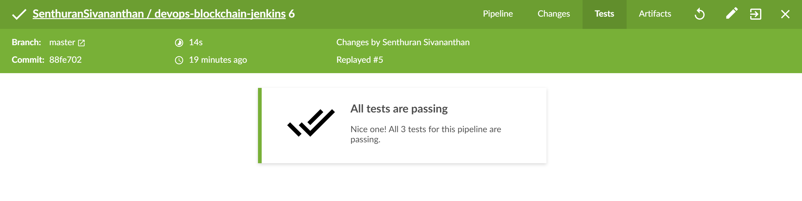
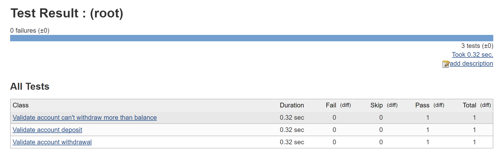
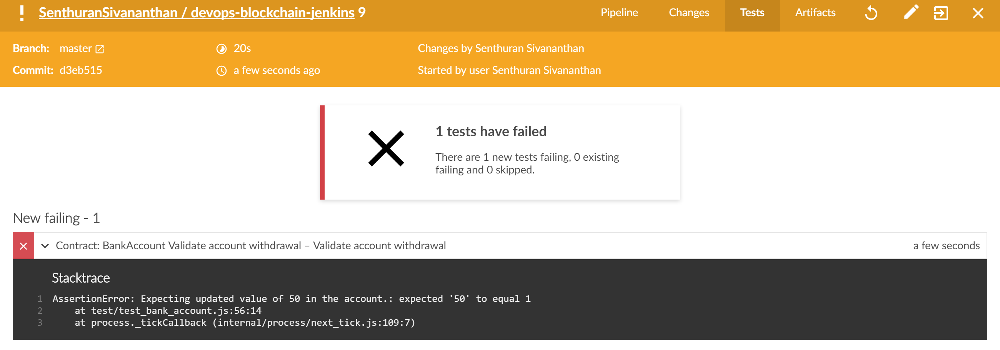

# DevOps for Blockchain using Jenkins

This project is inspired by the work of [Redback and Microsoft teams for developing the process using VSTS](https://microsoft.github.io/techcasestudies/redback-devops.html).

I've chosen to develop a similar DevOps process with Jenkins, Truffle and TestRPC so that we can give choices for our customers.

The project contains the components needed to create the test pipeline.

## Building Jenkins Server

The current version is based on a single instance of Jenkins running Ubuntu 17.04.  The scripts can be adapted for other Linux distributions as needed.

The script to automate the deployment is located at [jenkins/master-install.sh](jenkins/master-install.sh).  Jenkins installation is split into 2 routines.  First, install the dev tools needed to compile and deploy Java and Node applications such as JDK, Node, npm, Git and Jenkins itself.

Followed by tools needed for running Ethereum locally on the Jenkins server.  We'll be using [Truffle Framework](http://truffleframework.com/) for writing contracts, integration tests and running tests.  [testrpc](https://github.com/ethereumjs/testrpc) will provide an in-memory blockchain environment that's fast and predictable.

I've chosen to write the tests in [Mocha](https://mochajs.org/) as it's a versatile framework that can be used not just for Smart Contracts, but for integration testing across the entire application stack, thus allowing the developers to learn less and do more.  The results are written into XML using the Mocha JUnit Reporter.  The XML results can then be pulled into Jenkins as part of the build process.

### Install Dev Tools

```bash
apt-get install -y openjdk-8-jdk-headless
apt-get install -y git

wget -q -O - https://pkg.jenkins.io/debian-stable/jenkins.io.key | sudo apt-key add -
echo deb http://pkg.jenkins.io/debian-stable binary/ | sudo tee /etc/apt/sources.list.d/jenkins.list
apt-get update
apt-get install -y jenkins

apt-get install -y python-software-properties
curl -sL https://deb.nodesource.com/setup_7.x | sudo -E bash -

apt-get install -y nodejs
apt-get install -y npm
```

### Install Ethereum Tools

```bash
npm install -g ethereumjs-testrpc
npm install -g solc
npm install -g truffle
npm install -g mocha
npm install -g mocha-junit-reporter

mkdir -p /opt/ethereum/web3j
wget https://github.com/web3j/web3j/releases/download/v2.3.1/web3j-2.3.1.tar -O /tmp/web3j.tar
tar -xf /tmp/web3j.tar --directory /opt/ethereum/web3j --strip-components=1
```

### Install Jenkins and Tools using Azure Resource Manager (ARM) Template

The full VM deployment and configuration can be automated through an ARM template.  The template is located in [/jenkins/arm/deploy-ubuntu-master.json](/jenkins/arm/deploy-ubuntu-master.json).  This template will:

* Setup a new virtual network, subnet, network security groups
* Deploy an Azure Marketplace Ubuntu 17.04 VM with public IP address
* Install Jenkins, Dev Tools and Ethereum Tools - this script is located in [/jenkins/install-jenkins-master-ubuntu.sh](/jenkins/install-jenkins-master-ubuntu.sh)

You can customize the ARM template such that it can be:

* Deployed into an existing environment
* Restrict access through network security groups
* Replace username/password for the VM with SSH Keys

#### To deploy using Azure Portal

* Login to Azure Portal
* From the left ribbon, search for Templates
* Create a new template
* Copy & Paste the contents of the JSON file
* Save
* Click Deploy, follow the prompts to completion

#### To deploy through Azure CLI

Coming soon

#### To deploy through PowerShell

Coming soon

## Using Truffle Framework

An example Smart Contract and it's corresponding integration tests are located in the (/ethereum)[/ethereum].

### To initialize a new project

```bash

cd <project directory>
truffle init

```

You should now have a few directories & files:

* contracts/ - stores all Smart Contracts
* tests/ - stores all test cases
* migration/ - contracts that allow for deploying Smart Contracts to Blockchain
* truffle.js - truffle configuration file

The Smart Contracts are written in [Solidity](http://solidity.readthedocs.io/en/develop/introduction-to-smart-contracts.html) and will store the files with *.sol* extension.  There are example test cases written in Solidity (*.sol* extension) and Mocha (*.js* extension).  The choice of the language is up to you.

### Executing Integration Tests

You can run the integration tests against your own new project or the example Smart Contract(s) located in this project.

```bash

cd <project directory>

# Start testrpc in the background and save the pid.  You can set this up on another terminal as well.
testrpc &
echo $! >> testrpc.pid

# Run the tests
truffle test

# Stop testrpc
kill -9 `cat testrpc.pid`

```

### Exporting Integration Test Results

You can export the integration tests into multiple formats.  For this project, I'm using JUnit Reporter so that it can be read by Jenkins.  The configuration is located in *truffle-jenkins.js*.  To use this version, rename truffle-jenkins.js to *truffle.js*.


# Test Automation

I've chosen to use *Jenkinsfile* to declaratively configure the build pipeline.  This allows for the build definitions to be version controlled along with the source code.

The pipeline is split into 3 stages:

* Launching testrpc
* Executing Smart Contract tests
* Publishing test results using JUnit



In the future, we can add additional stages to integrate with the full application stack for end to end testing.  The stages allow for easier monitoring & troubleshooting as builds are executed:



Since we are using Mocha JUnit Reporter with Truffle, Jenkins is able to process the `test-results.xml` and display the test status as part of the dashboard.



And you will be able to drill down into each test case for deeper look.



When Smart Contract tests fail, the error information is displayed directly in Jenkins, thus aligning to existing developer testing/workflows:



More to come ...
